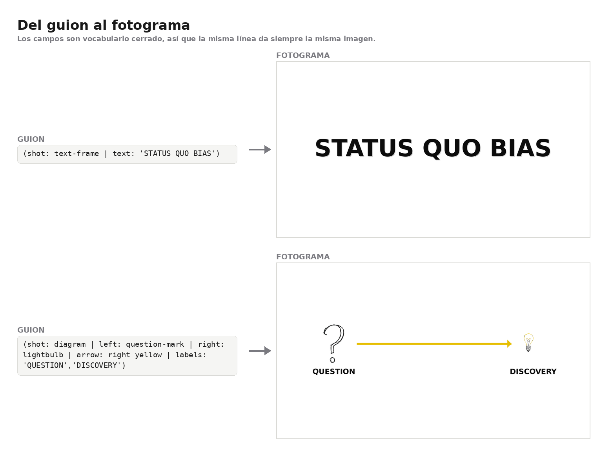
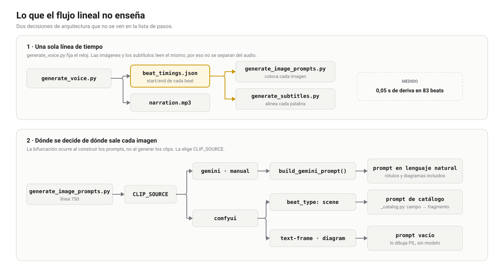

# Garabato

**Escribes el guion, sale el vídeo montado.**

Monté esto para no tener que editar a mano cada vídeo de un canal de YouTube
sin cara: vídeos explicativos de psicología y comportamiento, narrados, con
ilustraciones de monigote y subtítulos quemados. Escribo el guion y el resto
lo hace el pipeline: voz, imágenes, subtítulos y montaje final.



Cada frase del guion lleva delante una línea de campos que describe su imagen.
Los campos son vocabulario cerrado, así que la misma línea da siempre el mismo
fotograma. Esos dos tipos de plano los dibuja el propio repo con PIL, sin GPU y
sin modelo, cuando `CLIP_SOURCE` es `comfyui`.

La idea era resolver el cuello de botella real. Grabar la voz y buscar o
dibujar una imagen por cada frase es lo que hace que un vídeo de ocho minutos
cueste un día entero. Todo lo demás (guion, criterio, revisión) sigue siendo
mío, porque es donde está el valor.

## Cómo funciona

Un guion de texto plano entra por `input/script.txt` y sale un `final_video.mp4`:

```
input/script.txt
  ↓ parse_script.py            segments.json
  ↓ generate_voice.py          narration.mp3 + beat_timings.json
  ↓ generate_image_prompts.py  image_prompts.json
  ↓ generate_clips.py          clips/seg_NNN.mp4
  ↓ generate_subtitles.py      subtitles.srt + subtitles.ass
  ↓ assemble_video.py          final_video.mp4
  ↓ check_audio.py             informe de validación
```

```bash
python run_pipeline.py [slug]
```

Cada paso es idempotente: si vuelves a lanzarlo se salta lo que ya está hecho,
así que puedes cortar por la mitad y retomar, o rehacer solo un tramo.

Esa lista es el orden de ejecución, pero deja fuera las dos decisiones que
de verdad sostienen el pipeline:

<picture>
  <source media="(prefers-color-scheme: dark)" srcset="docs/img/architecture-dark.svg">
  
</picture>

**El reloj.** `generate_voice.py` concatena el audio sin huecos y deja en
`beat_timings.json` el inicio y el fin reales de cada beat. Las imágenes y los
subtítulos no cuentan el tiempo por su cuenta: los dos leen ese archivo. Es la
razón de que no se separen del audio, y de que un vídeo generado antes de que
existiera no haya manera de sincronizarlo sin rehacerlo.

**La bifurcación.** Dónde sale cada imagen no se decide al generar los clips
sino antes, al construir los prompts (`generate_image_prompts.py:750`). Con
`gemini` o `manual` se manda un prompt en lenguaje natural para *todos* los
beats, y el modelo ilustra también los rótulos y los diagramas. Con `comfyui`
esos dos tipos salen con prompt vacío y los dibuja PIL, y solo los planos de
escena pasan por el catálogo cerrado. Mismo guion, dos caminos distintos: por
eso los rótulos no se ven igual según el backend.

## El formato de guion

El guion no es prosa suelta. Cada frase de narración va precedida de una línea
de campos entre paréntesis que describe su imagen:

```
TITLE: Why Habits Change Everything

NARRATION:
[SEGMENT 1]
(shot: medium | char: 1, worried | pose: arms-crossed | prop: red-X right | bg: plain-white)
Every time you try to change, your brain treats it like a threat.

(shot: text-frame | text: 'STATUS QUO BIAS')
Scientists call this the status quo bias.

[SEGMENT 2]
(shot: diagram | left: question-mark | right: lightbulb | arrow: right yellow | bg: plain-white | desc: a question mark on the left turning into a glowing lightbulb on the right)
A simple question turns into a real discovery.
```

Los campos son vocabulario cerrado, no texto libre. `scripts/_catalog.py` es la
fuente de verdad y `prompts/beat_format.md` la referencia para escribir.

Esto empezó siendo prosa libre y fue el mayor error del proyecto. Un modelo de
difusión rápido atiende a tres o cuatro elementos por imagen y ya: si le das un
párrafo, elige él cuáles. Con campos cerrados el prompt se monta con una
búsqueda en un diccionario, sale igual dos veces seguidas y se puede validar
antes de gastar una sola generación.

El campo `desc:` es la excepción a propósito: una descripción literal de lo que
hay en el cuadro, un solo momento congelado. Es lo que hace que la imagen
ilustre la frase en vez de quedarse en una pose genérica. Sin `desc:`, el beat
cae de vuelta al catálogo, así que los guiones antiguos siguen funcionando.

Antes de generar nada:

```bash
python scripts/lint_script.py [slug]
```

El linter avisa pero no bloquea: comprueba que las poses estén en el catálogo,
que los `text:` no pasen de cuatro palabras y que la mezcla de tipos de plano
se parezca a la que funciona.

## Requisitos

| Pieza | Nota |
|---|---|
| Python | 3.10 o superior |
| FFmpeg | con `h264_nvenc`. El binario que uso viene sin `libx264` |
| Voz | Chatterbox, en local, sobre GPU |
| Imágenes | Gemini 2.5 Flash Image por API, o ComfyUI con Flux Schnell en local |
| Subtítulos | `stable-ts`, que baja el modelo Whisper `base` la primera vez |
| Tipografía | Ninguna. Usa la que ya tengas; ver [Tipografía](#tipografía) |

```bash
pip install -r requirements.txt
```

Toda la configuración está en `config.py`: voz, estilo, rutas, backend de
imagen. No hay ajustes repartidos por los scripts.

### La clave de API

Nunca en un archivo versionado. O la variable de entorno `GEMINI_API_KEY`, o un
`secrets_local.py` en la raíz (está en `.gitignore`):

```python
GEMINI_API_KEY = "..."
```

`config.py` mira primero el entorno y luego el archivo.

### Tipografía

No hay que instalar nada. `config.py` busca por nombre de archivo en los
directorios de fuentes de Linux, macOS y Windows, y termina en una negrita
genérica (DejaVu Sans, Liberation Sans, Noto Sans, Arial) que existe en
cualquier máquina. Si no encuentra ninguna, los renderers caen a la fuente por
defecto de PIL en vez de reventar.

Para usar la tuya, cualquiera de las dos:

1. Deja el `.ttf` en `assets/fonts/`. Lo que haya ahí gana sobre todo lo demás,
   sin instalar y sin tocar código. Esa carpeta está en `.gitignore`.
2. Pon el nombre del archivo, sin extensión, al principio de `FONT_PATHS_BOLD`
   o `FONT_PATHS_REGULAR` en `config.py`.

Las manuscritas que están arriba de la lista (Caveat, Architects Daughter,
Patrick Hand) son opcionales: si algún día las instalas, se cogen solas y el
texto pega mejor con el monigote.

Los subtítulos van aparte, porque quien los pinta al quemarlos es libass y
resuelve por nombre de familia, no por ruta: eso es `SUBTITLE_STYLE["font"]`.

### Los tres backends de imagen

`CLIP_SOURCE` en `config.py` elige entre tres rutas:

- `"manual"`: `scripts/export_prompts.py` te escribe la lista de prompts con el
  nombre de archivo exacto de cada uno. Los generas a mano en la web, los
  guardas como `clips/seg_NNN_src.png` y el pipeline monta los clips con lo que
  encuentre. Sale gratis y se puede hacer por tandas.
- `"gemini"`: lo mismo pero automático por API. Necesita facturación activada,
  la API de imagen no tiene capa gratuita. Salen unos tres euros por vídeo.
- `"comfyui"`: ComfyUI con Flux Schnell en local. Es el backend original y lo
  mantengo como respaldo.

Para que el monigote sea el mismo en todos los planos, `assets/character_ref.png`
se pasa como referencia en cada imagen con personaje. Esa hoja de modelo se
genera una vez con el prompt de `assets/character_ref_prompt.txt`.

## Estructura

```
config.py                     Toda la configuración
run_pipeline.py               Orquestador de los siete pasos
│
├── scripts/
│   ├── _catalog.py           Vocabulario cerrado: campo → fragmento de prompt
│   ├── parse_script.py       script.txt → segments.json
│   ├── generate_voice.py     Chatterbox → narration.mp3
│   ├── generate_image_prompts.py  Timing de audio + montaje de prompts
│   ├── generate_clips.py     Reparte al backend que toque
│   ├── _gemini.py            Backend Gemini con reintentos y throttle
│   ├── _comfyui.py           Backend ComfyUI por lotes + fundido
│   ├── _text_frame.py        Render PIL de los rótulos
│   ├── _diagram_frame.py     Render PIL de los diagramas
│   ├── _sprites.py           Composición de iconos sobre la imagen
│   ├── generate_subtitles.py Alineación forzada → .srt + .ass
│   ├── assemble_video.py     Concatenado, audio, música y quemado
│   ├── check_audio.py        Valida LUFS, duración y palabras
│   └── lint_script.py        Validador de guion, no bloqueante
│
├── prompts/
│   ├── script_template.md    Instrucciones para escribir un guion entero
│   ├── beat_format.md        Especificación de campos y catálogos
│   └── generate.md           Prompt de generación de guion
│
├── tools/
│   └── make_readme_figures.py  Regenera docs/img/ con los renderers del repo
│
├── docs/
│   ├── decisiones.md         Por qué cada cosa está como está
│   └── img/                  Figuras del README
│
├── assets/
│   ├── sprites/              Iconos PNG con alfa
│   ├── fonts/                Tu tipografía, si quieres una (sin versionar)
│   └── character_ref.png     Hoja de modelo del monigote
│
└── output/<slug>/            Todo lo que genera el pipeline
```

Las figuras de este README no son capturas hechas a mano: salen de
`python tools/make_readme_figures.py`. La de los fotogramas llama a
`_text_frame.py` y `_diagram_frame.py`, los mismos módulos que usa el pipeline,
así que si cambias el estilo la regeneras y el README deja de mentir. El
diagrama se dibuja en el mismo script, en dos versiones para el tema claro y el
oscuro de GitHub.

## Decisiones que no se ven leyendo el código

Están en [`docs/decisiones.md`](docs/decisiones.md): por qué el prompt negativo
es inerte y no sirve de nada escribirlo, por qué la semilla se calcula por
segmento y no por índice global, por qué quité el efecto Ken Burns, por qué la
descripción del personaje se inyecta sola en vez de escribirla en el guion.

## Problemas conocidos

**El encoder.** Mi FFmpeg está compilado sin `libx264`, así que todo va por
`h264_nvenc`. Ya está puesto en `_comfyui.py` y `assemble_video.py`, pero si
alguien lo lleva a otra máquina es lo primero que hay que mirar.

**La GPU se cae con ComfyUI.** Generar imágenes en local a pleno rendimiento me
tumbaba la tarjeta. Dos cosas lo arreglaron casi del todo: bajar el límite de
potencia al 80-85%, que cuesta un 10% de velocidad y quita entre 10 y 15 grados,
y cerrar el navegador antes de lanzar el pipeline, porque la aceleración por
hardware compite por la VRAM. Si aun así se cae hace falta reiniciar entero; con
reiniciar el driver no vuelve. Con el backend de Gemini esto no pasa.

**Codificación en Windows.** Hay que poner `PYTHONIOENCODING=utf-8` y
`PYTHONUTF8=1` o la consola revienta con los acentos. Y si escribes
`input/script.txt` desde PowerShell con `Set-Content -Encoding utf8` te mete un
BOM que `parse_script.py` no traga.

**Vídeos anteriores al arreglo de audio.** Los que se generaron antes de que el
concatenado de voz fuese sin huecos tienen la narración más larga y no tienen
`beat_timings.json`, así que las imágenes y los subtítulos se van del audio.
Para arreglar uno: borra `narration.mp3`, `narration_processed.mp3`,
`image_prompts.json` y los `subtitles.*`, y vuelve a lanzarlo. Los audios por
beat se conservan y se reaprovechan.

## Estado

El pipeline funciona de punta a punta. Lo que está resuelto:

- Formato de beats estructurado, catálogos cerrados y linter.
- Voz sin huecos entre beats, con `beat_timings.json` como línea de tiempo
  única para imágenes y subtítulos. Medí 0,05 segundos de deriva en 83 beats.
- Prompts conscientes del personaje: el monigote solo entra cuando el beat lo
  pide, y los planos de objetos llevan instrucción explícita de que no salga
  nadie.
- Subtítulos tipo karaoke, cortados en los límites de beat para que el texto no
  se cruce con el cambio de imagen, y con la quinta parte inferior del cuadro
  reservada para que no quede nada detrás.
- Post de audio con ecualización y normalizado a -14 LUFS.

Lo que falta o está a medias:

- La voz va con la de serie de Chatterbox. Falta grabar o clonar una propia y
  apuntarla en `CHATTERBOX_REF_AUDIO`.
- La música de fondo (`BACKGROUND_MUSIC_PATH`) está sin poner.
- El entrenamiento de LoRA en `tools/lora_training/` quedó obsoleto cuando pasé
  a generar imágenes con referencia de personaje. Lo dejo porque el código de
  preparación del dataset y las pruebas sirven, pero ya no forma parte del
  pipeline.

## Restricciones que no toco

- `TTS_SPEED = 1.0`. Estirar el tiempo por debajo de 0,9x suena a robot.
- `h264_nvenc` para todo el encoding.
- Sin interfaz web y sin base de datos. Archivos y línea de comandos.
- Con ComfyUI, Flux Schnell va a `cfg=1.0` y sampler `euler`. A `cfg=1.0` el
  prompt negativo no hace nada, así que la calidad se controla solo con lo que
  se pide en positivo.

## Licencia

MIT, en [LICENSE](LICENSE). Los modelos que usa cada backend van por su cuenta
con la suya.
